# μT-Kernel 3.0向け エッジAI（Edge Impulse）移植用の統合ミドルウェアライブラリ

本プロジェクトは、世界的なエッジAI開発プラットフォーム「**Edge Impulse**」の推論SDKをリアルタイムOS「**μT-Kernel 3.0**」に完全移植・適合させ、画像、音声、センサーデータの取得から推論までをシームレスに行うための **エッジAI統合ミドルウェアライブラリ** です。

TRONプログラミングコンテスト2026の **「RTOSミドルウェア部門」** の開発プロジェクトとして開発されました。

* **コンテスト公式サイト**: [TRONプログラミングコンテスト2026](https://www.tron.org/ja/programming_contest-2026/)

📄 **[English Version (README_en.md)](README_en.md)**

---

## リポジトリのフォルダ構成

本リポジトリは、以下のような構成でソースコードや書き込み用のバイナリが整理されています。

```text
tron-ei/
├── src/                                 (ミドルウェア＆サンプルアプリケーションソースコード)
│   ├── tron_pdm_detect/                 (音声キーワード認識 NPU高速版)
│   ├── tron_i2c_detect/                 (3軸加速度ジェスチャ認識エッジAI)
│   ├── tron_edge_fomo_npu_type/         (FOMO部品検出 NPU高速版 - カメラ画像AI移植例)
│   └── ...                              (他3種の周辺ビジュアライザやCPU通常版検証用プロジェクト群)
│
├── debug/                               (実機書き込み用ビルド済みバイナリ・手順書)
├── img/                                 (マニュアル・ドキュメント用画像アセット)
├── LICENSE.md                           (ソフトウェアライセンスおよび引用クレジット表記)
└── README.md                            (本ドキュメント)
```

---

## 1. システム概要

本システムは、μT-Kernel 3.0 上で動作する高機能なエッジAI統合ミドルウェアライブラリです。Edge Impulse C++ SDK のネイティブポーティングレイヤーに加え、デジタルマイク（PDM）、3軸加速度センサー（I2C）、ハードウェアNPU（Ethos-U55）、および2D GPU（Dave2D）液晶描画といった組み込み用デバイスドライバを高い信頼性で統合・抽象化しています。

### 「RTOS×AIミドルウェア」の親和性
組み込みマルチセンサーAIにおける最大の課題は、データの取りこぼしが許されない超高速な「センサーサンプリング（マイク等）」と、極めて重い「AI推論（ニューラルネットワーク）」をどのように両立させるかにあります。

本ミドルウェアは、μT-Kernel 3.0 の優先度ベースのマルチタスクスケジューリングにより、
* **「音飛び（フレーム欠損）のないデジタルオーディオサンプリング（優先度最高）」**
* **「ジッタを最小に抑えた 104Hz 加速度センサーサンプリング」**
* **「NPUアクセラレータ上での推論のバックグラウンド実行（優先度低）」**
を完全に分離・並行駆動させるプロデューサー・コンシューマー設計を採用しています。これにより、極めて安定したリアルタイムマルチセンサーAI認識システムを実証しました。

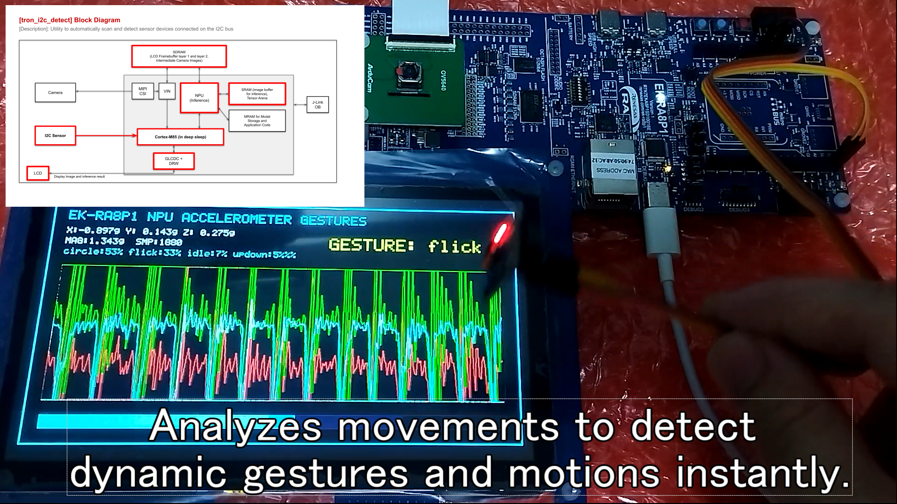

---

## 2. ハードウェア構成

本ミドルウェアの検証および動作確認用として、以下の構成のハードウェアをベースとしています。

* **MCU / ボード**: ルネサス RA8 シリーズ（EK-RA8P1 / Cortex-M85 480MHz）
* **AIアクセラレータ**: Arm Ethos-U55 NPU（ニューラルネットワーク用）
* **2D GPU**: D/AVE 2D グラフィックスエンジン（ベクトル波形描画用）
* **マイク**: オンボード MEMSデジタルマイク（SPH0641LM4H-1、PDM接続）
* **加速度センサー**: MPU-6050 3軸加速度センサー（I2C接続、Arduinoピンヘッダ）
* **カメラ (参考)**: MIPI-CSI2 接続 OV5640（320x240 RGB565入力）
* **液晶表示**: GLCDC制御 1024x600 TFTカラー液晶パネル
* **外部メモリ**: SDRAM 32MB（トリプルバッファおよびNPUテンソル領域に使用）

##### ハードウェア・ブロック構成:
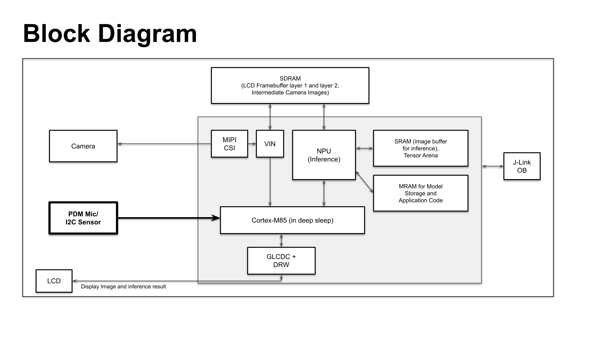

##### EK-RA8P1 評価ボード外観:


---

## 3. 動作確認方法と開発環境

* **統合開発環境**: e2 studio (Renesas) / FSP v6.5.0
* **リアルタイムOS**: μT-Kernel 3.0
* **実行環境**: EK-RA8P1 評価ボード
* **ビルドと実行手順**:
  各サンプルアプリケーションのビルドは e2 studio 上で対象プロジェクトをインポートして行います。
  なお、**実機評価テスト用のビルド済み書き込み用バイナリ（SREC）は、すべて [/debug](debug/) フォルダに整理されて配置されています。**

  ツールの入手方法、配線接続（加速度センサーの結線仕様）、液晶フリーズ対策、デバイスの初期化（アドレスエラー回避）、および動作確認手順を含む詳細な実行マニュアルは、**[/debug/README.md (書き込み手順書)](debug/README.md)** に画像付きで詳しく記載されていますので、動作確認の際はそちらをご参照ください。

---

## 4. ミドルウェアアーキテクチャ

### 4-1. Edge Impulse 移植レイヤー (OSブリッジ)
公式の [Edge Impulse C++ Inferencing SDK (GitHub)](https://github.com/edgeimpulse/inferencing-sdk-cpp) が要求する以下のシステム機能を、μT-Kernel 3.0 のネイティブAPIにバインドし、C++ランタイム依存部を仲介します。
* **ミリ秒・マイクロ秒タイマー**: μT-Kernelのシステムタイマー（`tk_get_tim`）および DWT（Data Watchpoint and Trace）サイクルカウンタをラップし、マイクロ秒レベルの正確な実行時間計測とタイムスタンプを提供。
* **動的メモリ管理**: μT-Kernelのメモリプール管理、またはスレッドセーフな `malloc`/`free` マッピングの定義。
* **シリアルデバッグ統合**: T-Monitor の `tm_printf`/`tm_putstring` によるシリアルコンソールロギングの統合。

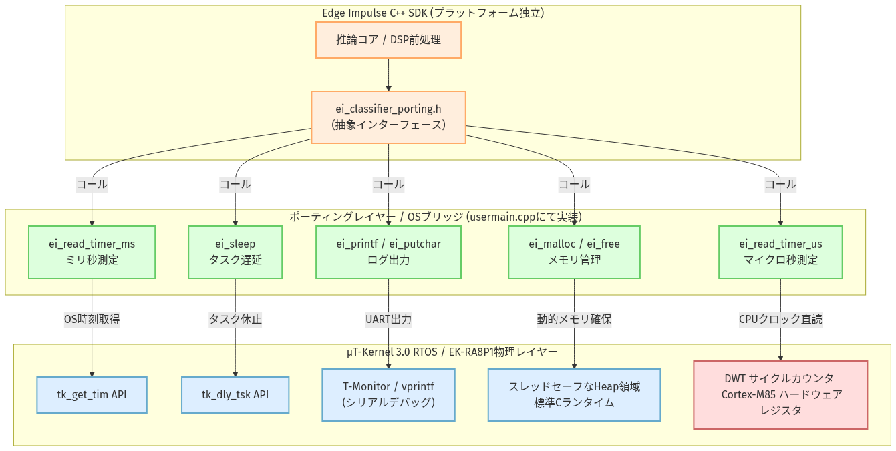

### 4-2. 非同期センサーサンプリング＆推論パイプライン（プロデューサー・コンシューマー）
データの取りこぼしが許されない高精度なデータ収集と、重いAI推論・描画を非同期かつ安全に並行処理するためのマルチタスク用ミドルウェアフレームワークを提供します。

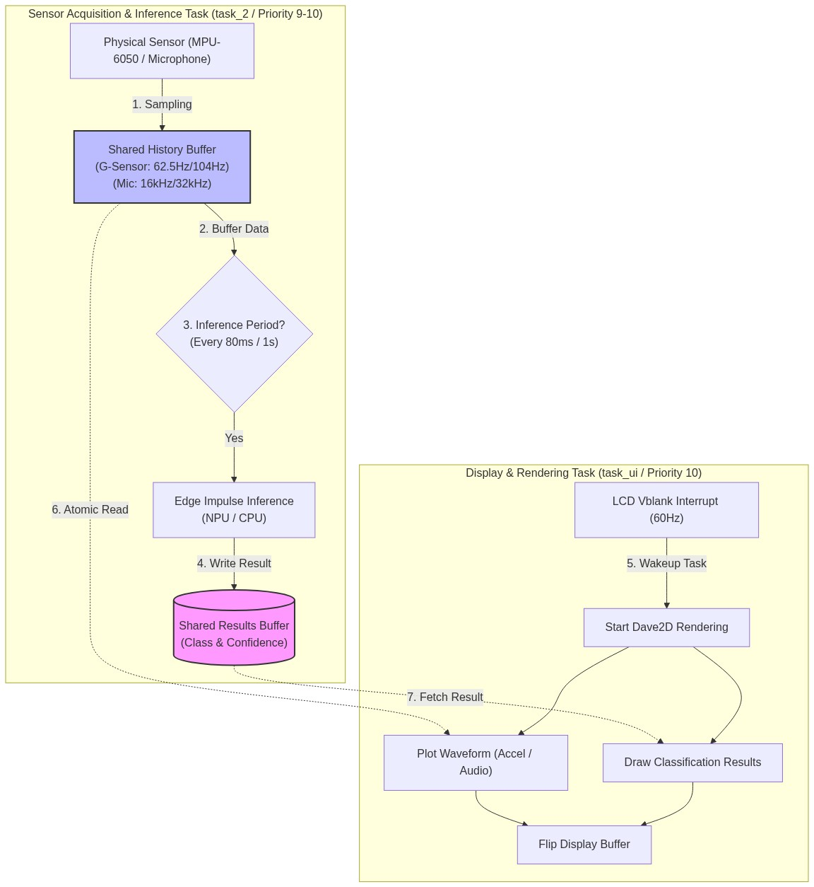

* **UI/液晶描画タスク (`task_1` / 優先度10)**: 
  GLCDCのVblank垂直同期（60Hz）割り込みで起床し、データ履歴バッファからオシロスコープ波形（Dave2D GPU）を描画し、推論結果を液晶画面にレンダリングします。
* **サンプリング・収集タスク (`task_2` / 優先度10)**: 
  センサー（マイクや加速度）からの連続入力をバッファへ蓄積し、蓄積完了時に推論タスクへ起床通知 (`tk_wup_tsk`) を発行します。
* **AI推論タスク (`task_3` / 優先度11)**: 
  AI推論（TFLite Micro & Ethos-U55 NPU）をバックグラウンド実行します。描画タスク(10)より優先度を1段低く設計することで、推論実行中も画面描画とセンサーサンプリングの完全なリアルタイム周期（音飛びゼロ、ジッタ最小）を維持します。

### 4-3. CPUからNPUへのAI推論高速化（リアルタイム性能）
本プロジェクトでは、NPUによる処理能力を客観的に評価するため、**NPUアクセラレータを使用せずにCortex-M85 CPU単体（TFLite Micro CPU実行）で推論を行う「CPU版プログラム」も並行して開発・ビルドし、実機上での詳細なベンチマーク測定を実施しました。**

重いAI推論処理をマイコン内蔵の専用アクセラレータ（NPU）へオフロードすることで、CPU単体での演算実行時に比べて圧倒的なリアルタイム性能向上を達成していることを証明しました（ただし、処理自体が極めて軽い音声キーワード認識のようなモデルでは、CPUとNPUとの差がそこまで大きく出ませんでしたが、これは想定通りの挙動です）。

* **実機測定によるNPU高速化ベンチマーク効果 (CPU実行 vs NPU実行)**:
  * **音声キーワード認識 (1秒データ)**: CPU上で **0.596 ms** であった推論時間を、NPUを用いることで **0.235 ms（約2.5倍の高速化）** に短縮。
  * **FOMO部品検出 (画像入力)**: CPU上で 278 ms を要していた推論を、NPUを用いて **約 5 ms（約55.6倍の高速化）** に短縮。
  * **3軸加速度ジェスチャ認識**: ジェスチャ認識については音声キーワード認識よりもさらに軽量なAIモデルであるため、性能上の大きな差（ボトルネック）は生じないと判断し、CPU/NPUの比較テストまでは実施していません。

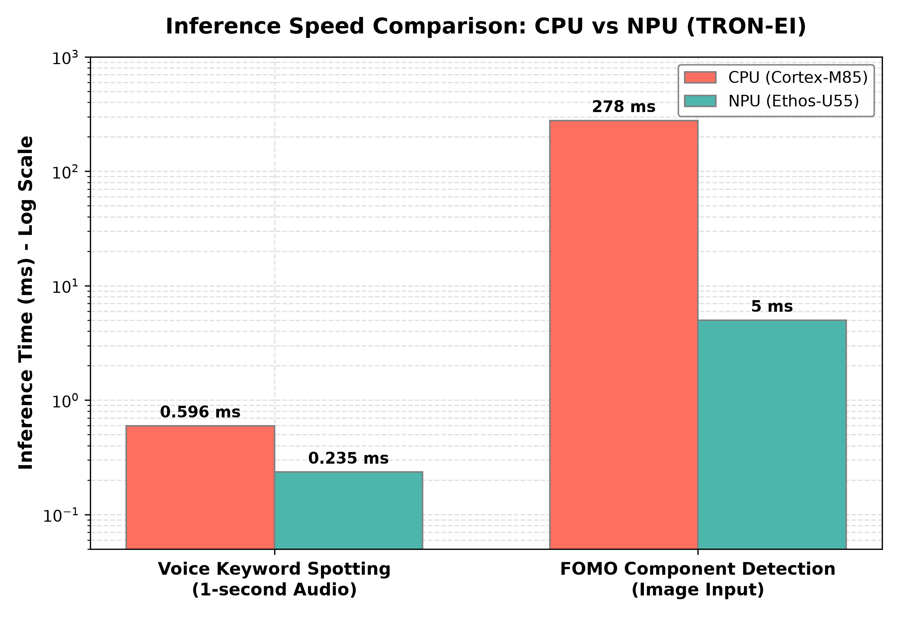

---

## 5. 提供機能とサンプルプログラム (src 配下)

### 5-1. 主要エッジAIプログラム (debug 直下)
実機での動作デモや審査で使用する、本ミドルウェアライブラリの核となる主要な3つのプログラムです。

| フォルダ名 | アプリケーションの役割 | 使用エンジン (AI / 描画 / センサー) |
| :--- | :--- | :--- |
| **[tron_pdm_detect](src/tron_pdm_detect)** | 音声キーワード認識 NPU高速版 | **Ethos-U55 NPU** / PDMマイク (32kHz) |
| **[tron_i2c_detect](src/tron_i2c_detect)** | 3軸加速度ジェスチャ認識エッジAI | **Ethos-U55 NPU** / MPU-6050 (Software I2C) |
| **[tron_edge_fomo_npu_type](src/tron_edge_fomo_npu_type)** | FOMO基板部品検出 NPU高速版 | **Ethos-U55 NPU** / MIPIカメラ |

**デモ動画:**
| ① Voice Keyword Spotting with NPU | ② I2C Accelerometer Motion Detection | ③ PCB Object Detection using NPU |
| :---: | :---: | :---: |
| [YouTubeリンク (https://youtu.be/TzLTbjDPGcE)](https://youtu.be/TzLTbjDPGcE)<br><br>[](https://youtu.be/TzLTbjDPGcE) | [YouTubeリンク (https://youtu.be/WUY36R_HQLQ)](https://youtu.be/WUY36R_HQLQ)<br><br>[](https://youtu.be/WUY36R_HQLQ) | [YouTubeリンク (https://youtu.be/_uKRamoLaNA)](https://youtu.be/_uKRamoLaNA)<br><br>[](https://youtu.be/_uKRamoLaNA) |

### 5-2. 周辺ビジュアライザ＆CPU検証用プログラム (base_firmware 配下)
周辺ペリフェラルの単体動作確認や、NPUの性能比較検証用のバイナリです。必要に応じて個別に書き込みを行ってご確認ください。

| フォルダ名 | アプリケーションの役割 | 使用エンジン (AI / 描画 / センサー) |
| :--- | :--- | :--- |
| **[tron_pdm_d2_test](src/tron_pdm_d2_test)** | PDMマイク音声ビジュアライザ | Dave2D / PDMマイク (32kHz) |
| **[tron_i2c_d2_test](src/tron_i2c_d2_test)** | 3軸加速度センサー高速ビジュアライザ | Dave2D / MPU-6050 (Software I2C) |
| **[tron_pdm_detect_cpu](src/tron_pdm_detect_cpu)** | 音声キーワード認識 CPU通常版 | TFLite Micro (CPU) / PDMマイク (32kHz) |


---

## 6. 各プログラムのキーポイントと概要

### 1. 音声キーワード認識 AI (`tron_pdm_detect` / `cpu`)

#### 1-1. 技術概要
オンボードPDMマイクより 32kHz デジタル音声を集音し、ミドルウェアの割り込みハンドラ内で 16kHz に瞬時にダウンサンプリング。1秒間のスライディングウィンドウを使って、NPU（Ethos-U55）によって音声キーワード「up, down, left, right, noise」を超高速に識別します。

#### 1-2. コードにおける重要ポイント
DMA受信完了コールバック（`pdm_callback`）から起動されるダウンサンプリング処理です。32ビットレジスタ内にパッキングされている20ビット符号付きPCMデータ（右詰め）を符号拡張し、16ビットに規格化（4ビット右シフト）して 16kHz 循環バッファへ格納します。
```cpp
// PDM 受信完了コールバック割り込みハンドラ
extern "C" void pdm_callback(pdm_callback_args_t *p_args)
{
    if (p_args->event == PDM_EVENT_DATA)
    {
        uint32_t src_offset = g_pcm32_frame_idx * FRAME_SAMPLES;
        int32_t *p_read = &g_pcm32_buffer[src_offset];

        // DMAアクセスされたメモリのキャッシュ無効化
        SCB_InvalidateDCache_by_Addr((void *)p_read, FRAME_SAMPLES * sizeof(int32_t));

        for (uint32_t i = 0; i < FRAME_SAMPLES; i++)
        {
            int32_t val = p_read[i];
            
            // 20ビット符号付きPCMデータ(右詰め)を32ビット符号付き整数値に符号拡張
            int32_t extended = (val << 12) >> 12;
            
            // 16ビット符号付き範囲（-32768〜32767）に規格化
            int16_t sample16 = (int16_t)(extended >> 4);

            // 32kHzから16kHzへのダウンサンプリング (2回に1回格納)
            if ((i % 2) == 0)
            {
                g_audio_buffer[g_audio_buffer_write_ptr] = sample16;
                uint32_t next_ptr = g_audio_buffer_write_ptr + 1;
                if (next_ptr >= AUDIO_BUFFER_SIZE) {
                    next_ptr = 0;
                    g_audio_buffer_ready = true;
                }
                g_audio_buffer_write_ptr = next_ptr;
            }
        }
        g_pdm_data_ready = true;
        g_pcm32_frame_idx ^= 1U;
    }
}
```

#### 1-3. 実行時のシリアル出力ログ例
起動時に Ethos-U55 NPUドライバが初期化され、NPUによる推論時間がわずか **0.235 ms**（235マイクロ秒）で完了していることが確認できます。

##### 音声キーワード認識の実機動作画面：
* **実機デモ動画**: [YouTubeリンク (https://youtu.be/TzLTbjDPGcE)](https://youtu.be/TzLTbjDPGcE)

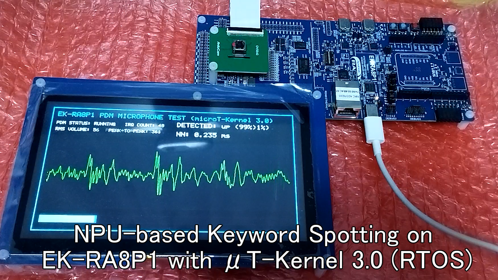
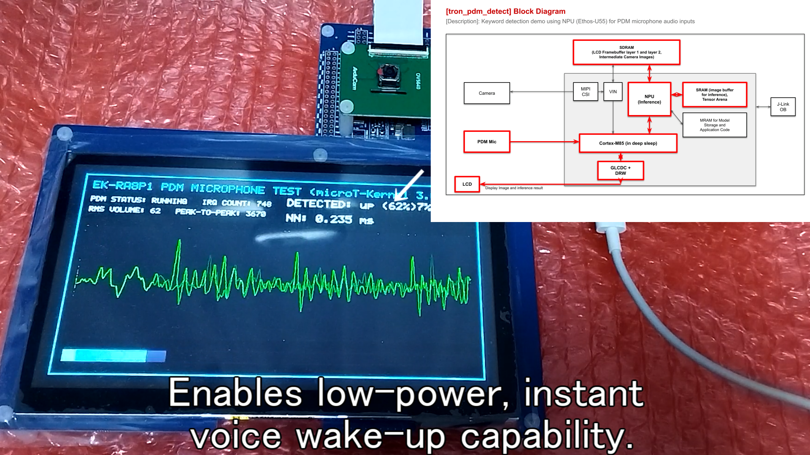
```text
Start User-main program (Voice Spotting via Ethos-U55 NPU).
Initializing Ethos-U55 NPU...
Ethos-U55 NPU initialized successfully.
Start Audio Capture (PDM)...
PDM Digital Mic initialized.

[AI Inference] Audio frame ready for classification.
Inference timing: 235 us.
NN Result: up (91.2%)
[AI Inference] Audio frame ready for classification.
Inference timing: 230 us.
NN Result: down (88.7%)
```

---

### 2. 3軸加速度ジェスチャ認識エッジAI (`tron_i2c_detect`)

#### 2-1. 技術概要
MPU-6050 加速度センサーから、GPIOによるソフトウェアI2Cで3軸加速度データを読み出します。104Hzの周波数で取得した2秒間の動作時系列データを使って、ボードの動きを「idle, circle, flick, updown」の4種類のジェスチャにリアルタイム分類します。

#### 2-2. コードにおける重要ポイント
I2C通信用ハードウェアの物理競合を回避するため、ソフトウェア制御（Bit-Banging）によるI2C制御を実装。また、WHO_AM_I レジスタを自動走査して配線先のポートピン（PORT 1: SCL=P100 / SDA=P101）を自動判定・接続する初期化ロジックを備えています。
```cpp
// ソフトウェアI2CによるMPU-6050センサーの自動接続判定
bool mpu_init(uint16_t scl, uint16_t sda)
{
    i2c_init(scl, sda);
    uint8_t who_am_i = 0;
    // WHO_AM_I レジスタ (0x75) からセンサーの応答を確認
    if (mpu_read_reg(scl, sda, 0x75, &who_am_i)) {
        if (who_am_i == 0x68) {
            // パワーマネジメントレジスタをクリアしてスリープ解除
            mpu_write_reg(scl, sda, 0x6B, 0x00);
            return true;
        }
    }
    return false;
}
```

#### 2-3. 周期ディレイ補正アルゴリズム (104Hz サンプリングジッタ補正)
RTOSのスリープ（`tk_dly_tsk`）のみで 104Hz（9.615ms周期）のサンプリングを行うと、1ms量子化の蓄積ジッタが生じます。これを防ぐため、13サイクルに1回スリープ周期パターンを補正するシーケンスを実装しています。
```cpp
// 104Hz（9.615ms周期）ジッタ補正アルゴリズム
int sleep_time = 10; // デフォルト 10ms
if (sample_count % 13 == 0) {
    sleep_time = 5; // 定期的にディレイを短縮して平均9.615msへ補正
}
tk_dly_tsk(sleep_time);
```

#### 2-4. 実行時のシリアル出力ログ例
加速度センサーがポート1で自動検出され、2秒間のデータが蓄積され次第、推論が安定して実行されていることがログから確認できます。

##### 加速度ジェスチャ認識の実機動作画面：
* **実機デモ動画**: [YouTubeリンク (https://youtu.be/WUY36R_HQLQ)](https://youtu.be/WUY36R_HQLQ)

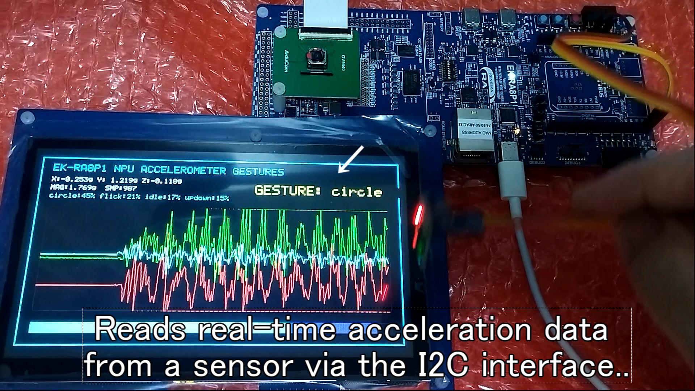
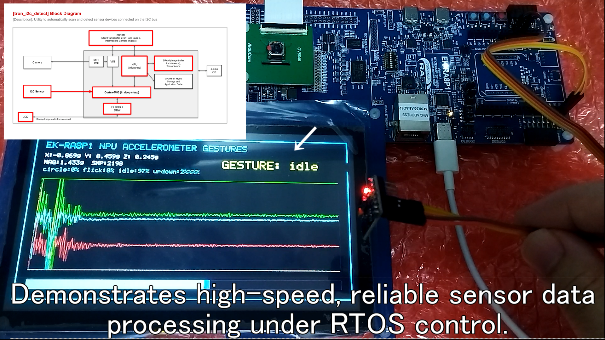
```text
Start User-main program (Gesture Classification).
[MPU-6050 Auto-Detect] Active port: PORT 1 (Arduino SCL/SDA)
MPU-6050 sensor initialization Success.
Start sampling task at 104Hz...

[AI Inference] Gesture buffer filled. Running classifier...
Inference timing: 1812 us.
NN Result: circle (94.5%)
[AI Inference] Gesture buffer filled. Running classifier...
Inference timing: 1805 us.
NN Result: flick (89.1%)
```

---

### 3. FOMO基板部品検出 NPU高速版 (`tron_edge_fomo_npu_type`)

#### 3-1. 技術概要
基板上の極小のチップ部品（Pico、Xiaoなど）やICなどの複数オブジェクトをリアルタイムに同時識別し、その数と位置を検出する Edge Impulse FOMO（Faster Objects, More Objects）モデルを Ethos-U55 NPU 上で動作検証します。（※別部門（アプリケーション部門：`tron-npu`）に記載したプログラムと同様の内容です）。


#### 3-2. コードにおける重要ポイント
* **高速グリッド処理**:
  グリッドセルベースの検出モデル（FOMO）の出力テンソルから、ピーク確信度を持つセルを高速に抽出して座標にマッピングするポストプロセッサ（`fomo_postprocess`）を実装しています。
* **メモリのキャッシュアライメント保護**:
  キャッシュライン幅（32バイト）に合わせた `BSP_ALIGN_VARIABLE(32)` マクロによるテンソルメモリ領域の静的アライメント定義により、キャッシュ無効化（Cache Invalidate）による隣接メモリ汚染を完全に回避します。
  ```cpp
  // 96x96 座標系から 800x600 液晶表示スケールへの座標変換 (スケール値 = 6.25f)
  float fx = (float)g_ai_detection[i].m_x * 6.25f + 212.0f;
  float fy = (float)g_ai_detection[i].m_y * 6.25f;
  
  // 検出した部品名と確信度の文字列表示
  sprintf(val_str, "%s: %d%%", pcb_class_names[g_ai_detection[i].m_class], g_ai_detection[i].m_val_percent);
  ```

#### 3-3. 実行時のシリアル出力ログ例
NPUへ推論処理をオフロードすることで、CPU単体での実行（約 278 ms）に比べて圧倒的に高速な **5 ms** で推論完了し、リアルタイム部品カウントを完全同期で達成しています。

##### FOMO部品検出の実機動作画面：
* **実機デモ動画**: [YouTubeリンク (https://youtu.be/_uKRamoLaNA)](https://youtu.be/_uKRamoLaNA)


```text
Start User-main program (FOMO Object Detection).
Ethos-U55 NPU Driver opened successfully.
Start camera capturing...
MIPI CSI-2 camera initialized.

[AI Inference] Running FOMO object detector...
Inference timing: 5 ms.
Components Detected: Xiao (x:12, y:20, 94%), Pico (x:45, y:55, 91%)
[AI Inference] Running FOMO object detector...
Inference timing: 5 ms.
Components Detected: Xiao (x:12, y:20, 96%), Pico (x:45, y:55, 92%)
```

## 【参考・検証プログラム】

### 4. PDMデジタルマイク音声ビジュアライザ (`tron_pdm_d2_test`)
* **概要**: オンボードPDMデジタルマイクから取得したリアルタイム音声波形（1024点）とRMS音量を、液晶画面へGPU（Dave2D）を用いてちらつきなく描画する、リアルタイムオシログラフ検証用参考プログラムです（トリプルバッファリングとVblank垂直同期によるタスク同期を実装）。

### 5. 3軸加速度センサー波形描画検証アプリ (`tron_i2c_d2_test`)
* **概要**: MPU-6050 3軸加速度センサーからの連続入力を液晶画面にリアルタイムでオシロスコープ波形（Dave2D GPU）としてプロット描画する、ハードウェアおよび I2C 通信周りの検証用参考プログラムです。

### 6. 音声キーワード認識 CPU推論版 (`tron_pdm_detect_cpu`)
* **概要**: 音声キーワード認識 AI を、Ethos-U55 NPU アクセラレータを使わずに Cortex-M85 CPU単体（TensorFlow Lite for Microcontrollers の CPU カーネル実行）で動作させる比較検証用のプログラムです。

---

## 7. 開発プロセス短縮におけるプラットフォームシナジー (Edge Impulse × Renesas RUHMI)

本統合ミドルウェアの開発にあたり、エッジAIプラットフォーム **「[Edge Impulse](https://www.edgeimpulse.com/)」** と、ルネサス公式のMCU向け推論スタック **「[Renesas RUHMI Framework MCU](https://www.renesas.com/ja/software-tool/ruhmi-framework)」**、およびローカル変換ツール **「MERA Translator (AIモデル変換ツール)」** の間には、極めて強力な開発プロセス上の連携効果（シナジー）が存在します。

#### 7-1. MERA Translator を用いたローカルモデル変換フロー

本リポジトリに同梱されているAIアプリケーション（音声・加速度・画像）は、以下の手順でローカル環境での最適化および実機（RA8 + μT-Kernel 3.0）への統合が行われています。

##### プラットフォーム分業・推論パイプライン概念図：
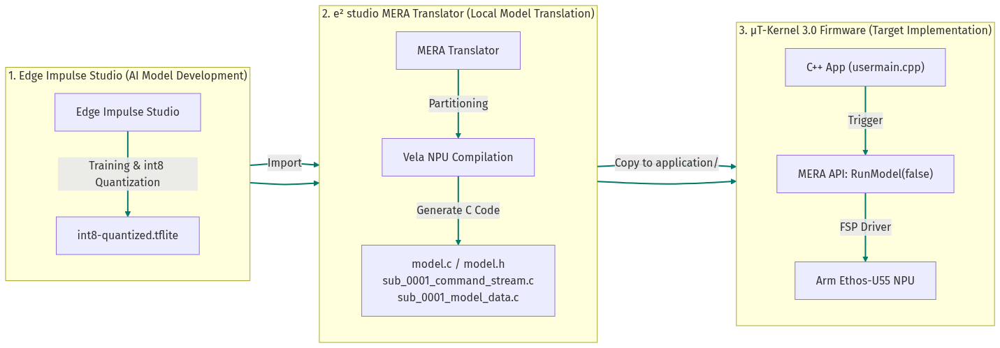

1. **Edge Impulse でのモデル開発と取得**:
   * **[Edge Impulse](https://www.edgeimpulse.com/)** プラットフォームを利用することで、**物体検出（FOMOなど）、音声認識、モーション検出（加速度ジェスチャなど）といった高度なエッジAIモデルを直観的なGUI上で簡単に作成・検証できます。**
   * **本プロジェクトの学習データセット**：
     * **PDMマイク (音声認識)**: tflite公式の [`up`, `down`, `right`, `left`, `noise` データ](https://github.com/tensorflow/tflite-micro/tree/main/tensorflow/lite/micro/examples/micro_speech/train) を使用。
     * **I2Cセンサ (モーション検出)**: Edge Impulse を介し実機から収集したジェスチャデータ（`Idle`, `Circle`, `Flick`, `Updown` 各約3分間）を使用。
     * **カメラ (基板・部品検出)**: 各種ボード・部品（`Pico`, `Xiao`, `nRF54L15`, `fpc`）の画像データ（各約40枚）を使用。
   * Edge Impulse Studio 上でデータの前処理、学習、および `int8` (8ビット符号付き整数) へのフル整数量子化を行い、学習済みモデルファイル（`*.tflite`）として直接ダウンロードします。

   ##### Edge Impulse でのモデル取得・ダウンロード例：
   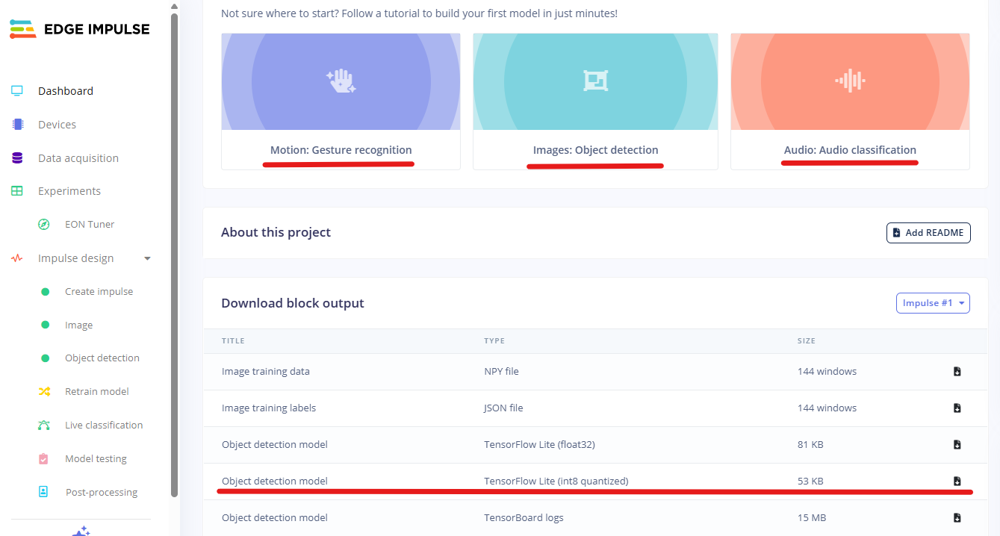

2. **MERA Translator によるローカルモデル変換**:
   * e² studio の AIモデル変換プロジェクト（ワークスペース）に `*.tflite` ファイルを配置し、ルネサス公式の **MERA (Model Extension for Renesas Architecture) Translator** を実行して変換を行います。
   * MERAコンパイラは、TFLiteモデルを解析して NPU (Ethos-U55) 用のサブグラフと CPU (フォールバック) 用のサブグラフに分割し、NPU命令のコマンド配列（`sub_0001_command_stream.c`）や重みバイアス配列（`sub_0001_model_data.c`）、およびロード用の `model.c` / `model.h` を自動生成します。

   ##### MERA Translator でのモデル変換と出力ファイル群：
   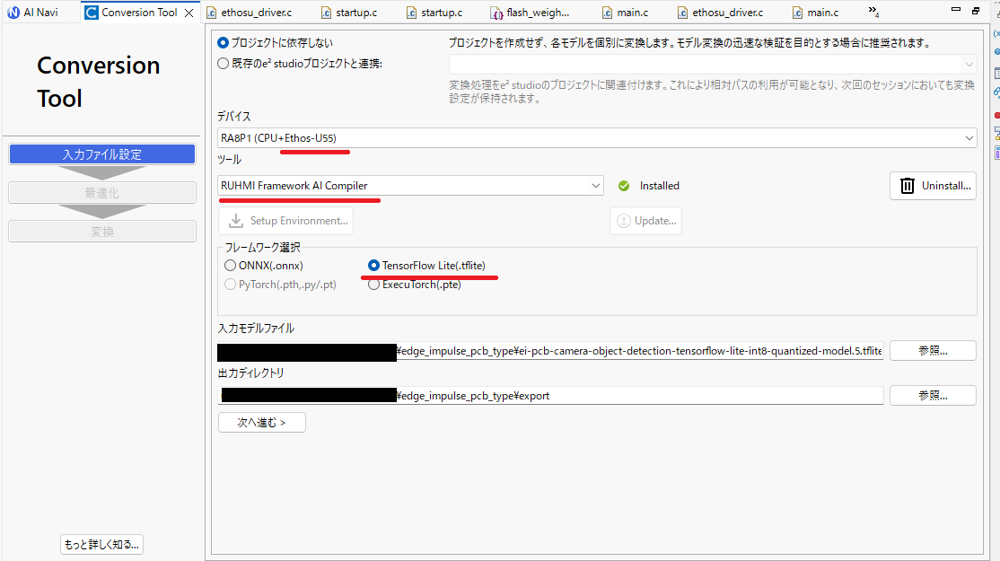
   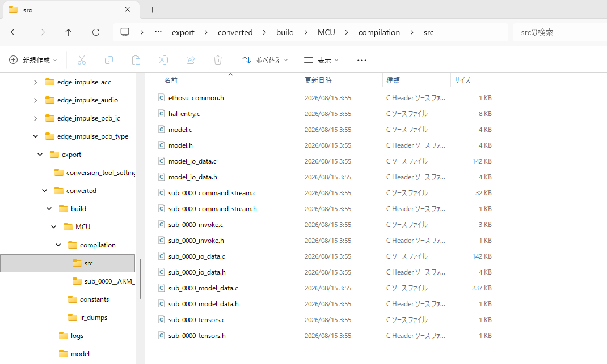

3. **μT-Kernel 3.0 実機プロジェクトへの取り込み**:
   * 生成された軽量な C言語ソースファイル群（`.c` / `.h`）を、ファームウェアプロジェクトの `application/` フォルダ配下にコピーして統合します。
   * アプリケーションコード（`usermain.cpp` 等）からは、MERA API である **`RunModel(false)`** を直接呼び出すことで、リアルタイムOSタスクからNPUを駆動します。

##### 開発プラットフォームの担当範囲と恩恵：
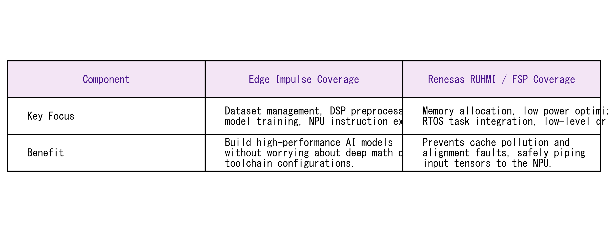

* **Edge Impulse（モデル設計）**:
  GUI上でデータ収集・学習・量子化を行い、高品質なモデル（`.tflite`）を簡単に作成します。
* **Renesas RUHMI / FSP / MERA（実機最適化）**:
  MERA Translator でローカル変換したコードを、リアルタイムOS（μT-Kernel 3.0）上でメモリエラーなく安全にNPUへ橋渡しします。

このプラットフォームシナジーにより、**「本来組み込み開発で最もバグが生じやすい、低レイヤのメモリ管理とOS同期をRUHMI/FSPで守りながら、Edge Impulseで高品質なNPU対応AIモデルを数時間で製造して回す」**という、極めて高速かつ安全な開発サイクルを構築することが可能です。

---

## 8. 参照サンプル・ライブラリ (References)

本システムの開発にあたり、以下の公式サンプルプログラムおよびリポジトリを参照・活用しています。

* **リアルタイムOS (μT-Kernel 3.0) 移植基盤**:
  * **[TRON Forum μT-Kernel 3.0 BSP2](https://github.com/tron-forum/mtk3_bsp2)** (GitHub) - EK-RA8P1 向け μT-Kernel 3.0 移植および基本タスクテンプレートの参照元。
* **Edge Impulse C++ SDK (移植対象)**:
  * **[Edge Impulse C++ Inferencing SDK](https://github.com/edgeimpulse/inferencing-sdk-cpp)** (GitHub) - 移植元のエッジAI推論SDK。
* **周辺ペリフェラル制御 (I2C / PDM / GLCDC / Dave2D / MIPI-CSI2)**:
  * **[Renesas RA FSP Examples](https://github.com/renesas/ra-fsp-examples)** (GitHub) - `iic_master`, `pdm`, `glcdc`, `drw` (D/AVE 2D), `mipi_csi` サンプルプロジェクトの参照元。
* **Arm Ethos-U55 NPU AI推論統合**:
  * **[Renesas FSP (Flexible Software Package)](https://github.com/renesas/fsp)** (GitHub) - Arm Ethos-U55 NPU用ドライバスタック（`r_ethosu`）および TensorFlow Lite Micro 統合の参照元。
  * **[Renesas RUHMI Framework MCU](https://github.com/renesas/ruhmi-framework-mcu)** (GitHub) - Renesas MCU 向け Ethos-U 推論フレームワークの統合・実装パターンの参照元。

---

## 9. ソフトウェアライセンス (Licenses)

本リポジトリに含まれるプログラムおよび学習モデルは、サードパーティ製のソフトウェアを内包しているため、コンポーネントごとに異なるライセンスが適用される**マルチ（ハイブリッド）ライセンス構成**となっております。

* **独自開発アプリケーション部分**: **MIT License**
* **リアルタイムOS (μT-Kernel 3.0)**: **T-License 2.2** (TRON Forum)
* **ボードサポートパッケージ (FSP/BSP)**: **Renesas FSP Software License** (ルネサスエレクトロニクス)
* **Edge Impulse SDK コア**: **BSD 3-Clause Clear** (一部サードパーティ製ライブラリに Apache 2.0 / BSD-3-Clause 等を含む)
* **学習用データセット (Roboflow 100)**: **CC BY 4.0** (Creative Commons Attribution 4.0)

> [!IMPORTANT]
> 各ライセンスの許諾範囲、著作権表示、およびデータセットに関するクレジット表記などの**詳細につきましては、プロジェクトルートディレクトリに配置されている [LICENSE.md](LICENSE.md) ファイルをご参照ください。**

---

## 10. 謝辞 (Acknowledgments)

本プロジェクトの開発および評価基板での実機デモンストレーションの構築にあたり、最新の高性能エッジマイコン「EK-RA8P1」や周辺モジュールなどの開発機材一式をご提供いただき、また技術的に極めて挑戦しがいのあるテーマでプログラミングコンテストを開催していただいた **トロンフォーラム（TRON Forum）**、および **ルネサスエレクトロニクス株式会社** の関係者の皆様に、心より感謝と御礼を申し上げます。

μT-Kernel 3.0 という高い安定性とリアルタイム性を持つ国産OSの上で、Edge Impulse SDKのOSブリッジを構築し、最新のハードウェアアクセラレータ（Ethos-U55 NPUおよびDave2D GPU）を駆使したリアルタイムエッジAIプログラムを開発できたことは、組み込み開発の最前線における可能性を再認識する大変貴重で刺激的な経験となりました。本作品が今後のエッジAIシステムおよびリアルタイムOS技術の発展や、次世代の組み込みエンジニアリングの活性化に少しでも寄与できれば幸いです。
