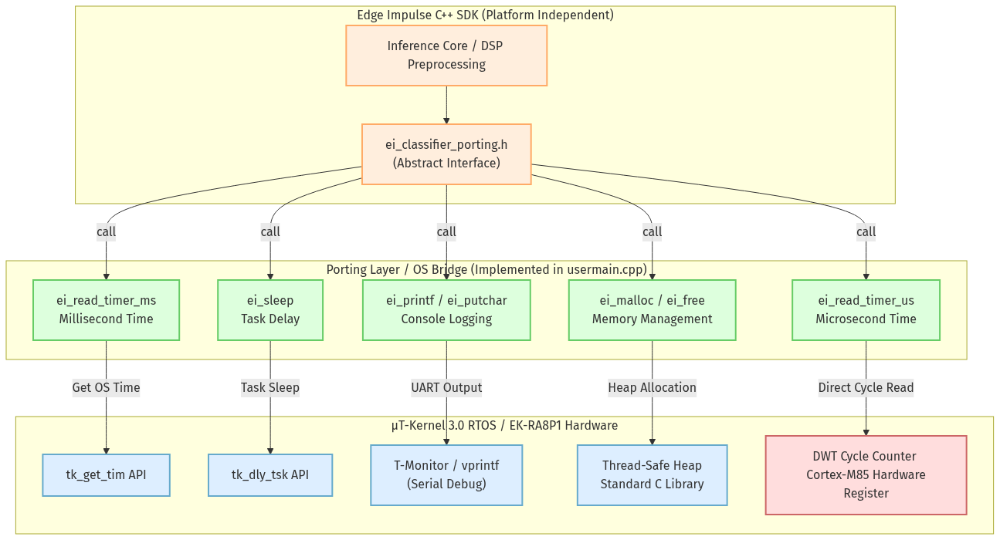

# Edge Impulse Integration Middleware Library for μT-Kernel 3.0 (TRON-EI)

This project is a high-performance **Edge AI Integration Middleware Library (TRON-EI)** running under the **μT-Kernel 3.0** real-time OS. It ports and integrates the inference SDK of the industry-standard edge AI platform, **Edge Impulse**, enabling seamless data capture, preprocessing, and real-time inference for image, audio, and motion sensor inputs.

Developed as a development project for the **RTOS Middleware Category** of the TRON Programming Contest 2026.

* **Contest Official Site**: [TRON Programming Contest 2026](https://www.tron.org/programming_contest-2026/)

📄 **[日本語版 (README.md)](README.md)**

---

## Directory Structure

This repository organizes source files and pre-built binaries as follows:

```text
tron-ei/
├── src/                                 (Middleware & Sample Application Source Code)
│   ├── tron_pdm_detect/                 (Voice Keyword Spotting on NPU)
│   ├── tron_i2c_detect/                 (3-axis Accelerometer Gesture Recognition AI)
│   ├── tron_edge_fomo_npu_type/         (FOMO Component Detection on NPU - Vision AI Reference)
│   └── ...                              (3 Visualizers and CPU-only Baseline Projects)
│
├── debug/                               (Pre-built SREC Binaries & Flashing Manual)
│   └── base_firmware/                   (Verification & Reference Binaries)
├── img/                                 (Manuals & Document Image Assets)
├── LICENSE.md                           (Software License & Citation Credits)
└── README.md                            (This document)
```

---

## 1. Middleware Overview & Background

This middleware library runs on μT-Kernel 3.0, mapping the Edge Impulse C++ SDK to native RTOS APIs. It integrates hardware device drivers for digital microphones (PDM), 3-axis accelerometers (I2C), hardware NPU (Ethos-U55), and 2D GPU (Dave2D) LCD rendering into a robust, high-performance middleware stack.

### "RTOS × AI Middleware" Synergy
The main challenge in multi-sensor edge AI devices is to execute heavy AI neural networks without interrupting time-critical sensor capture tasks (e.g. microphones). 

Using the priority-based preemptive scheduling of μT-Kernel 3.0, this middleware implements a producer-consumer architecture:
* **"Zero-packet-drop Digital Audio Capture (Highest Priority)"**
* **"Jitter-compensated 104 Hz Accelerometer Sampling"**
* **"Background NPU Inference execution (Lowest Priority)"**
These are completely isolated and run in parallel, demonstrating a highly stable and real-time multi-sensor AI recognition system.


---

## 2. Hardware Specification

The middleware targets the following hardware configuration:

* **MCU / Board**: Renesas RA8 Series (EK-RA8P1 / Cortex-M85 480MHz)
* **AI Accelerator**: Arm Ethos-U55 NPU (for Neural Networks)
* **2D GPU**: D/AVE 2D Graphics Engine (for vector line drawing)
* **Microphone**: On-board MEMS Digital Microphone (SPH0641LM4H-1, PDM)
* **Accelerometer**: MPU-6050 3-axis accelerometer (I2C connected, Arduino Headers)
* **Camera (Reference)**: MIPI-CSI2 connected OV5640 (320x240 RGB565)
* **LCD Display**: GLCDC-controlled 1024x600 TFT Panel
* **External RAM**: 32MB SDRAM (used for Triple Buffering and NPU Tensor Arena)

##### Hardware Block Diagram:


##### EK-RA8P1 Evaluation Board Layout:


---

## 3. Flashing & Verification Guide

* **IDE**: e2 studio (Renesas) / FSP v6.5.0
* **Real-time OS**: μT-Kernel 3.0
* **Evaluation Hardware**: EK-RA8P1 Board
* **Flashing Procedure**:
  Source codes can be compiled by importing projects into e2 studio.
  **Pre-built SREC binary files for immediate evaluation are stored in [/debug](debug/) folder.**

  A comprehensive flashing manual containing step-by-step guides (including hardware connection specifications, troubleshooting screen freeze, flash memory initialization/erase, and serial logs verification) is located in **[/debug/README.md (Flashing Manual)](debug/README.md)**. Please refer to it when testing the projects.

---

## 4. Middleware Architecture

### 4-1. Edge Impulse Porting Layer (OS Bridge)
Binds the following system features required by the Edge Impulse SDK to native μT-Kernel 3.0 APIs:
* **Millisecond and Microsecond Timers**: Wraps system tick timer (`tk_get_tim`) and DWT (Data Watchpoint and Trace) cycle counters to provide microsecond-level execution timing.
* **Dynamic Memory Management**: Maps dynamic allocation API (`malloc`/`free`) to thread-safe pools or custom heap structures.
* **Serial Debug Console**: Routes Edge Impulse log outputs to T-Monitor CDC console serial interface.



### 4-2. Asynchronous Sampling & Inference Pipeline (Producer-Consumer)
Separates real-time sensor capturing from heavy AI neural networks and display updates using multi-task concurrency.


* **UI & Rendering Task (`task_1` / Priority 10)**:
  Wakes up on GLCDC Vblank vertical sync interrupt (60Hz), draws real-time sensor waveforms (via Dave2D GPU), and overlays AI classification outcomes onto the LCD.
* **Sensor Sampling Task (`task_2` / Priority 10)**:
  Continuously samples sensor inputs (microphone or accelerometer) to fill history buffers. Sends a wake-up signal (`tk_wup_tsk`) to the AI task when buffers are filled.
* **AI Inference Task (`task_3` / Priority 11)**:
  Runs classification using TensorFlow Lite Micro and Arm Ethos-U55 NPU driver. Set to a lower priority than UI/sampling tasks to guarantee zero packet drops.

### 4-3. Atomic Buffer Protection
To prevent race conditions between tasks, the middleware implements atomic data buffer updates using μT-Kernel dispatch lock APIs (`tk_dis_dsp` / `tk_ena_dsp`). This prevents data corruption while the AI task reads from high-frequency sensor buffers.

### 4-4. Performance Boost: CPU vs Ethos-U55 NPU
To evaluate NPU performance gains, a baseline version running inference strictly on the Cortex-M85 CPU (via TFLite Micro CPU execution) was compiled and benchmarked against the NPU-accelerated firmware. (Note that for lightweight models like voice keyword spotting, the performance difference between CPU and NPU remains minimal, which aligns with our expectations.)

* **AI Inference Speed Benchmark (CPU vs Ethos-U55 NPU)**:
  * **Voice Keyword Spotting (1-second window)**: Shrunk from **0.596 ms** on the CPU to **0.235 ms on the NPU (2.5x Speedup)**.
  * **FOMO Object Detection (PCB Components)**: Shrunk from 278 ms on the CPU to **~5 ms on the NPU (55.6x Speedup)**.
  * **3-axis Accelerometer Gesture Classifier**: Since the gesture recognition model is even lighter than the voice keyword spotting model, we did not execute CPU vs NPU comparison tests for this task, as no significant bottlenecks are expected.


---

## 5. Middleware Applications & Demos (under src)

### 5-1. Primary AI Applications (directly under debug/)
Core demonstration programs showing the capabilities of the ported NPU and SDK.

| Project Directory | Peripheral & Model | Acceleration Engine |
| :--- | :--- | :--- |
| **[tron_pdm_detect](src/tron_pdm_detect)** | Voice Keyword Spotting (NPU version) | **Ethos-U55 NPU** / PDM Digital Mic |
| **[tron_i2c_detect](src/tron_i2c_detect)** | 3-axis Accelerometer Gesture Classifier | TFLite Micro / MPU-6050 Accelerometer |
| **[tron_edge_fomo_npu_type](src/tron_edge_fomo_npu_type)** | FOMO Component Detection | **Ethos-U55 NPU** / MIPI-CSI2 Camera |

**Demo Videos:**
| ① Voice Keyword Spotting with NPU | ② I2C Accelerometer Motion Detection | ③ PCB Object Detection using NPU |
| :---: | :---: | :---: |
| [YouTube Link (https://youtu.be/TzLTbjDPGcE)](https://youtu.be/TzLTbjDPGcE)<br><br>[](https://youtu.be/TzLTbjDPGcE) | [YouTube Link (https://youtu.be/WUY36R_HQLQ)](https://youtu.be/WUY36R_HQLQ)<br><br>[](https://youtu.be/WUY36R_HQLQ) | [YouTube Link (https://youtu.be/_uKRamoLaNA)](https://youtu.be/_uKRamoLaNA)<br><br>[](https://youtu.be/_uKRamoLaNA) |

### 5-2. Visualizers & CPU Baseline Benchmarks (under base_firmware/)
Helper applications used to verify peripheral operations or benchmark CPU performance.

| Project Directory | Peripheral & Model | Acceleration Engine |
| :--- | :--- | :--- |
| **[tron_pdm_d2_test](src/tron_pdm_d2_test)** | PDM Mic Waveform Plotter | Dave2D GPU / PDM Digital Mic |
| **[tron_i2c_d2_test](src/tron_i2c_d2_test)** | Accelerometer Waveform Plotter | Dave2D GPU / MPU-6050 (Soft I2C) |
| **[tron_pdm_detect_cpu](src/tron_pdm_detect_cpu)** | Voice Keyword Spotting (CPU baseline) | Cortex-M85 CPU / PDM Digital Mic |


---

## 6. Implementation Notes & Technical Highlights

### 1. Voice Keyword Spotting (`tron_pdm_detect` / `cpu`)

#### 1-1. Technical Details
Captures digital audio from the on-board PDM microphone at 32 kHz. In the DMA interrupt context, the raw data is immediately down-sampled to 16 kHz. A 1-second sliding window runs through the Ethos-U55 NPU to identify keywords (`up`, `down`, `left`, `right`, `noise`).

#### 1-2. Code Highlights
Shows the down-sampling algorithm inside `pdm_callback`. Sign-extends 20-bit raw PCM inputs from 32-bit registers and normalizes the signal to a 16-bit range before placing it in the 16 kHz circular buffer.
```cpp
// PDM Data Reception Callback Interrupt Handler
extern "C" void pdm_callback(pdm_callback_args_t *p_args)
{
    if (p_args->event == PDM_EVENT_DATA)
    {
        uint32_t src_offset = g_pcm32_frame_idx * FRAME_SAMPLES;
        int32_t *p_read = &g_pcm32_buffer[src_offset];

        // Invalidate cache before reading DMA-updated buffer
        SCB_InvalidateDCache_by_Addr((void *)p_read, FRAME_SAMPLES * sizeof(int32_t));

        for (uint32_t i = 0; i < FRAME_SAMPLES; i++)
        {
            int32_t val = p_read[i];
            
            // Sign-extend 20-bit PCM to 32-bit integer
            int32_t extended = (val << 12) >> 12;
            
            // Normalize to 16-bit range (-32768 to 32767)
            int16_t sample16 = (int16_t)(extended >> 4);

            // Down-sample by 2: append 16-bit PCM values to 16kHz buffer
            if ((i % 2) == 0)
            {
                g_audio_buffer[g_audio_buffer_write_ptr] = sample16;
                uint32_t next_ptr = g_audio_buffer_write_ptr + 1;
                if (next_ptr >= AUDIO_BUFFER_SIZE) {
                    next_ptr = 0;
                    g_audio_buffer_ready = true;
                }
                g_audio_buffer_write_ptr = next_ptr;
            }
        }
        g_pdm_data_ready = true;
        g_pcm32_frame_idx ^= 1U;
    }
}
```

#### 1-3. Console Output Logs
Initializes the Ethos-U55 NPU driver. Inference completes in **0.235 ms** (235 microseconds).
```text
Start User-main program (Voice Spotting via Ethos-U55 NPU).
Initializing Ethos-U55 NPU...
Ethos-U55 NPU initialized successfully.
Start Audio Capture (PDM)...
PDM Digital Mic initialized.

[AI Inference] Audio frame ready for classification.
Inference timing: 235 us.
NN Result: up (91.2%)
[AI Inference] Audio frame ready for classification.
Inference timing: 230 us.
NN Result: down (88.7%)
```

---

### 2. Accelerometer Gesture Classifier (`tron_i2c_detect`)

#### 2-1. Technical Details
Uses bit-banged software I2C to read from the MPU-6050. Using a 2-second time-series buffer sampled at 104 Hz, it classifies motions into 4 dynamic gesture states (`idle`, `circle`, `flick`, `updown`).

#### 2-2. Code Highlights
Bypasses hardware I2C peripheral pin limitations using software I2C. Includes scan logic looking for MPU-6050 on the pins (PORT 1: SCL=P100 / SDA=P101).
```cpp
// Bit-banged I2C MPU-6050 Initialization & Search
bool mpu_init(uint16_t scl, uint16_t sda)
{
    i2c_init(scl, sda);
    uint8_t who_am_i = 0;
    // Check MPU-6050 WHO_AM_I register (0x75)
    if (mpu_read_reg(scl, sda, 0x75, &who_am_i)) {
        if (who_am_i == 0x68) {
            // Wake up MPU-6050 (clear sleep bit in power management register)
            mpu_write_reg(scl, sda, 0x6B, 0x00);
            return true;
        }
    }
    return false;
}
```

#### 2-3. Timing Compensation Algorithm (Jitter Control)
Eliminates 1 ms tick quantization jitter by applying a timing compensation algorithm that adjusts task delay times:
```cpp
// 104 Hz (9.615 ms period) timing compensation
int sleep_time = 10; // Default 10ms
if (sample_count % 13 == 0) {
    sleep_time = 5; // Reduce sleep periodically to maintain average 9.615ms period
}
tk_dly_tsk(sleep_time);
```

#### 2-4. Console Output Logs
Shows successful auto-detection on Port 1:
```text
Start User-main program (Gesture Classification).
[MPU-6050 Auto-Detect] Active port: PORT 1 (Arduino SCL/SDA)
MPU-6050 sensor initialization Success.
Start sampling task at 104Hz...

[AI Inference] Gesture buffer filled. Running classifier...
Inference timing: 1812 us.
NN Result: circle (94.5%)
[AI Inference] Gesture buffer filled. Running classifier...
Inference timing: 1805 us.
NN Result: flick (89.1%)
```

---

### 3. PDM Mic Waveform Plotter (`tron_pdm_d2_test`)

#### 3-1. Technical Details
Uses Dave2D GPU vector commands to plot microphone audio waveforms (1024 points) onto the LCD panel in real-time.

#### 3-2. Code Highlights
Demonstrates GPU vector line segments drawing:
```cpp
// Dave2D GPU real-time audio waveform plotter
d2_setcolor(d2_handle, 0, 0xFF00FF00); // Set line color to Green
d2_moveto(d2_handle, (d2_point)(0 << 4), (d2_point)((240 + (g_waveform_history[0] >> 6)) << 4));

for (int i = 1; i < WAVEFORM_POINTS; i++)
{
    int screen_x = (i * DISPLAY_HSIZE_INPUT0) / WAVEFORM_POINTS;
    int screen_y = 240 + (g_waveform_history[i] >> 6); // vertical scale
    d2_lineto(d2_handle, (d2_point)(screen_x << 4), (d2_point)(screen_y << 4));
}
d2_renderline(d2_handle);
```
