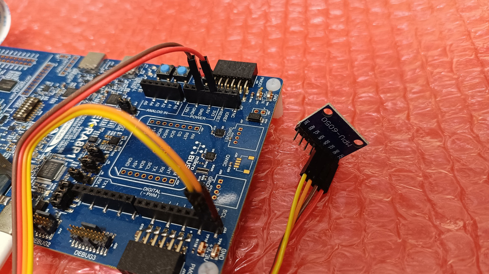
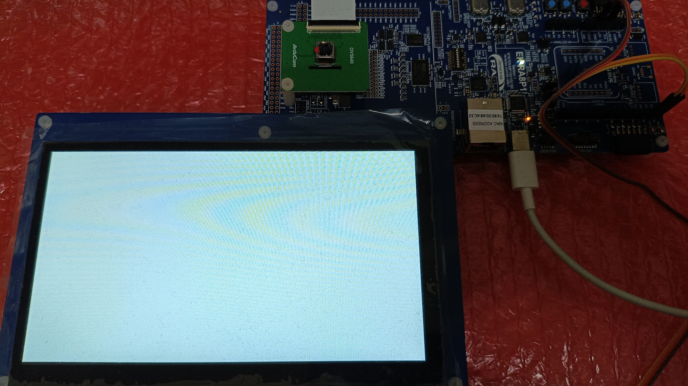
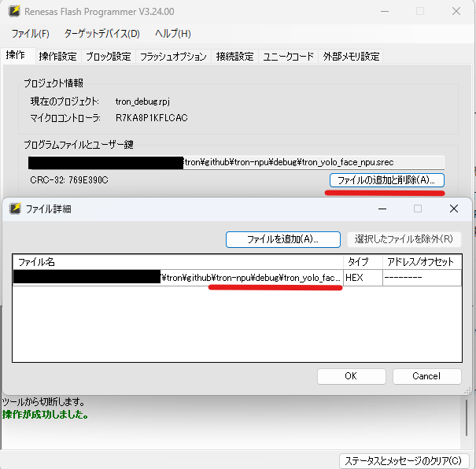
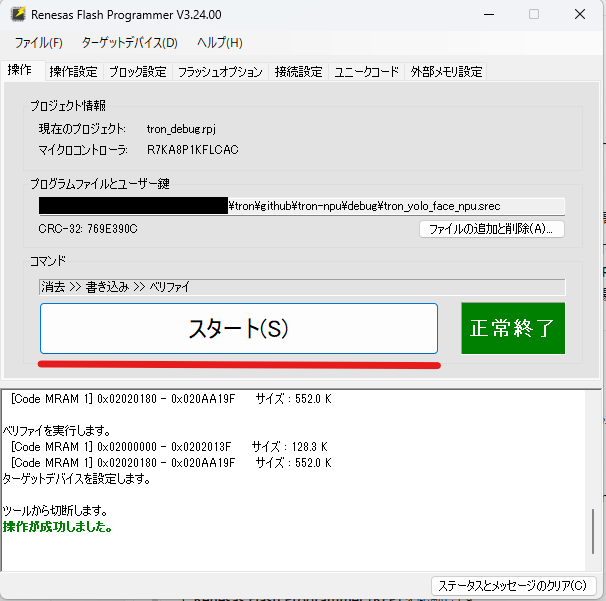
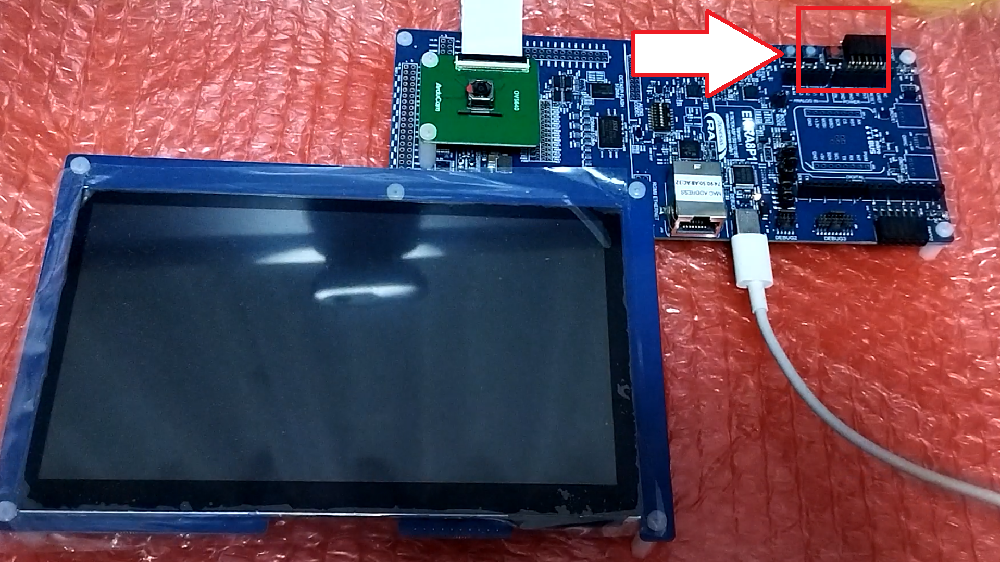

# EK-RA8P1 書き込み用(debug)手順書 — TRON-EI (ミドルウェア部門)

本フォルダは、μT-Kernel 3.0 およびエッジAI（Edge Impulse）ミドルウェア統合ライブラリを Renesas EK-RA8P1 評価ボードへ書き込むためのバイナリファイル（`.srec`）を集約・整理したフォルダです。

> [!NOTE]
> **動作対象ボードと配線に関する重要なお知らせ**
> * 本フォルダ内のプログラムの動作確認を行う際は、事務局へ提出済みの**「I2C加速度センサー（MPU-6050）および各種配線が接続された状態のEK-RA8P1ボード」**をそのままご使用いただけます。
> * **加速度センサー（MPU-6050）動作確認プログラム**を実行する際は、下図のように加速度センサーがポート1（3.3V,GND,Arduinoコネクタ部 SCL,SDA）に正しく配線されていることをご確認ください。
> * **デジタルマイク（PDMマイク）動作確認プログラム**を実行する際は、EK-RA8P1評価ボードの**オンボードデジタルマイク（SPH0641LM4H-1）**を使用するため、追加の外付けマイク接続や配線は不要です。
> * **FOMOカメラ物体検出プログラム**を実行する際は、カメラモジュールが接続済みの状態で送付しますので、そのままご使用ください。
>
> 
> 

---

## 1. フォルダ構成

本フォルダ内には、実機動作確認や審査で使用するビルド済みSRECバイナリファイルが以下のように整理されて配置されています。

* **`debug/` 直下 (メイン評価プログラム)**:
  実機での動作デモや審査で使用する、本ミドルウェアライブラリの核となる主要な3つのプログラムです。
  * `tron_pdm_detect.srec` (音声キーワード認識 NPU高速版)
    * オンボードPDMマイクからの入力を受け、NPU（Ethos-U55）によって「up, down, left, right」の音声キーワードを超高速に識別します。
  * `tron_i2c_detect.srec` (3軸加速度ジェスチャ認識エッジAI)
    * MPU-6050から読み出した3軸加速度データを使い、ボードの動きを「idle, circle, flick, updown」の4種のジェスチャに分類・識別します。
  * `tron_edge_fomo_npu_type.srec` (FOMO基板部品検出 NPU高速版)
    * カメラの映像から電子基板上の極小の部品（Pico、Xiao、nRF54L15など）をリアルタイムに同時識別し、個数と位置を検出・カウントします。

* **`base_firmware/` フォルダ配下 (検証・参考プログラム)**:
  以下の3つのプログラムは、基本ペリフェラルの単体動作確認や、NPUの性能比較検証用のバイナリです。**必要に応じて個別に書き込みを行い、動作確認にご活用ください。**
  * `tron_pdm_d2_test.srec` (PDMデジタルマイク音声ビジュアライザ)
    * PDMマイクから集音したリアルタイム音声波形とRMS音量を、液晶画面へGPU（Dave2D）を用いてちらつきなく描画します。
  * `tron_i2c_d2_test.srec` (3軸加速度センサー高速ビジュアライザ)
    * MPU-6050から取得した3軸（X, Y, Z軸）の加速度G波形データを、液晶画面へ高速描画するリアルタイムオシログラフデモです。
  * `tron_pdm_detect_cpu.srec` (音声キーワード認識 CPU通常版)
    * NPUを用いずメインCPU（Cortex-M85）上で音声キーワード認識をすべて処理します（推論速度・CPU負荷の比較検証用）。

---

## 2. ハードウェア接続・ピン仕様

ミドルウェア層によるセンサー接続ピンの自動検出機能および、マイク・カメラの動作仕様は以下の通りです。

### ① MPU-6050 加速度センサー (I2C) の接続ポート
本ミドルウェアは、起動時にI2Cのピンにセンサーが接続されていることを検知して起動します。提出ボードでは、以下のピン（SCL/SDA）にセンサーが配線されています。

* **信号線配線**:
  * センサーの **`SCL`** ➡ ボードの **`SCL`** (Arduinoコネクタ部 J24-10)
  * センサーの **`SDA`** ➡ ボードの **`SDA`** (Arduinoコネクタ部 J24-9)
* **電源配線**:
  * センサーの **`VCC`** ➡ ボードの **`3.3V`** ピン
  * センサーの **`GND`** ➡ ボードの **`GND`** ピン

### ② PDM デジタルマイク
* EK-RA8P1評価ボード上に標準搭載されているMEMSデジタルマイク（SPH0641LM4H-1）を使用します。
* ミドルウェアの内部処理で、PDMインターフェースを介した32kHzデジタル集音を行い、割り込み処理によって16kHzへのダウンサンプリングを瞬時に施してAI推論に引き渡します（追加の配線は一切不要です）。

### ③ MIPI-CSI2 カメラ (OV5640)
* カメラ画像AIテストの際は、同梱のカメラモジュールをボード裏面のMIPI-CSI2コネクタへ接続してください。

---

## 3. 書き込みツールの入手先

書き込みには、ルネサスエレクトロニクス公式の無料書き込みソフトウェア **Renesas Flash Programmer (Programming GUI)** を使用します。

* **ダウンロードページ**:
  [Renesas Flash Programmer (Programming GUI) 公式サイト](https://www.renesas.com/ja/software-tool/renesas-flash-programmer-programming-gui#downloads)
  * 上記リンク先のダウンロードセクションより、最新のインストーラ（Windows版もしくはPCに合った環境）をダウンロードしてPCにインストールしてください。

---

## 4. 書き込み手順 (プロジェクト作成から書き込みまで)

PCとボードを接続し、プロジェクトを作成してプログラムを書き込むまでの全手順です。

### ① ハードウェアの接続
1. パソコンと EK-RA8P1 ボード上のオンボードデバッガ用USBポート **`DEBUG1`**（micro-USB または USB-C）をUSBケーブルで接続します。

> [!WARNING]
> **液晶画面が真っ白になる現象（フリーズバグ）への対処**
> USBケーブルを挿し込んだ際、稀に液晶画面が真っ白になってフリーズする現象が発生することがあります。この現象が発生した場合は、**USBケーブルを一度抜いて、数秒〜数十秒ほど時間を置いてから、挿し直してください。**
>
> 

2. ボードの電源が入っている（LEDが点灯している）ことを確認します。

### ② プロジェクトの作成と設定

1. インストールした **Renesas Flash Programmer (RFP)** を起動します。
2. メニューの **[ファイル] ➡ [新しいプロジェクトの作成...]** を選択し、表示されるダイアログを以下のように設定します。

| 設定項目 | 設定値 |
| :--- | :--- |
| **マイクロコントローラ** | **`RA`** を選択 |
| **プロジェクト名** | 任意の名前（例: `RA8P1_Demo`） |
| **作成場所** | 任意のフォルダ（デフォルトのままでOK） |
| **通信ツール** | **`J-Link`** を選択 |
| **インターフェース** | **`SWD`** を選択 |

3. 入力後、右下の **[作成(C)]** をクリックします。これでターゲットボードとの接続が確立されます。

### ③ プログラムファイル（SREC）の選択

1. プロジェクト画面が開いたら、中央の「プログラムファイルとユーザー鍵」枠にある **[ファイルの追加と削除(A)...]** または入力欄の右側のボタンをクリックします。
2. 本 `debug/` フォルダ配下から、書き込みたいプログラムの **`.srec` ファイル**（例: `tron_pdm_detect.srec` または `base_firmware/tron_pdm_d2_test.srec`）を選択してロードします。

### ④ [重要] 書き込み前のデバイス初期化（アドレスエラー防止）

大きいプログラムを書き込む際、マイコン側に残っている古いメモリ境界の仕切り設定と競合し、書き込み開始時に以下のエラーが発生して失敗することがあります。
> `エラー(E1000008): デバイスでアドレスエラーが発生しました。(Command: 13, Response: D2)`

このエラーを未然に防ぐため、**ファイルをロードした後、書き込みをスタートする前に、必ず以下の「デバイスの初期化」を実行してください。**

1. RFPの上部メニューバーにある **`ターゲットデバイス(D)`** をクリックします。
2. ドロップダウンメニューから **`デバイスの初期化(I)...`** を選択して実行します。

3. 画面右側に緑色で「デバイスの初期化が成功しました」と表示されるのを待ちます。
   * （これによりマイコンの古いメモリ境界設定がクリアされ、新しいプログラムサイズに合わせた書き込みが可能になります）

### ⑤ 書き込みの実行

1. デバイスの初期化が完了したら、画面中央にある大きな **[スタート(S)]** ボタンをクリックします。
2. 自動でデバイス消去 ➡ 書き込み ➡ 照合（ベリファイ）が実行されます。
3. 書き込みが成功すると、画面右側に緑色の背景で **「操作が成功しました」** と表示されます。

4. 書き込み完了後、ボード上の `RESET` ボタン（赤いスライドスイッチ付近にある黒い小さなタクトスイッチ）を押すか、USBケーブルを抜き差しすると、新しいプログラムが再起動して動作を開始します。

---

## 5. USBシリアルログの確認手順

書き込み完了後、接続しているPC上のシリアルターミナルソフトを使用することで、ボードから出力される動作ログ（μT-Kernel 3.0 の起動シーケンスやAI推論処理時間など）をリアルタイムに確認することができます。

1. パソコンで任意のシリアルターミナルソフト（**Tera Term** や **MobaXterm** など）を起動します。
2. 接続先のCOMポートとして、ボードが認識しているCOMポート（J-Link CDC UART Port）を選択し、通信設定を以下のように設定します。

| 設定項目 | 設定値 |
| :--- | :--- |
| **ボーレート (Speed)** | **`115200`** |
| **データビット** | 8 bit |
| **パリティ** | なし (None) |
| **ストップビット** | 1 bit |
| **フロー制御** | なし (None) |

3. ポートをオープンした後、ボード上の `RESET` ボタンを押します。
4. 下図のように、μT-Kernel 3.0 が無事に起動したログや、AIモデルの推論所要時間などの実行データが順次出力されることを確認できます。

---

## 6. 各プログラムのデモ詳細と動作確認方法

各 `.srec` ファイルを書き込み後の具体的な確認手順です。

### ① 音声キーワード認識 NPU高速版 (`tron_pdm_detect.srec`)
* **動作・デモ**:
  * ボードの液晶画面にリアルタイムの音声入力波形が表示されます。
  * 評価ボード上のマイクに向かって、英語の指示語 **`"up"`, `"down"`, `"left"`, `"right"`** と発話してください。
  * キーワードを検出すると、画面中央に検出された指示語とその確信度（%）が大きく表示されます（環境音などは `"noise"` として除外されます）。
* **特徴・性能比較**:
  * NPU（Ethos-U55）によって音声特徴抽出と推論を **約3ms〜5ms** という超低遅延で処理します（NPU自体の純粋な推論時間は **0.235 ms**。ただし、1秒間の音声データを使っての推論を行っています）。
  * 音声サンプリング用のDMA割り込み処理とAI推論タスクがμT-Kernelの優先度制御で完全に分離されているため、高負荷な推論中も「音飛び（フレーム欠損）」が発生しない高信頼なオーディオ処理を実現しています。
* **実機デモ動画**:
  * [YouTubeリンク (https://youtu.be/TzLTbjDPGcE)](https://youtu.be/TzLTbjDPGcE)
    
    

### ② 3軸加速度ジェスチャ認識エッジAI (`tron_i2c_detect.srec`)
* **動作・デモ**:
  * MPU-6050センサーを搭載したEK-RA8P1ボードを持ち、空中で以下の特定のジェスチャを繰り返してください。
    * **`"idle"`**：ボードを机の上に置いて静止させる状態
    * **`"circle"`**：ボードで空中に円を描く動作
    * **`"flick"`**：ボードを素早く一瞬だけ払う（フリックする）動作
    * **`"updown"`**：ボードを上下に素早く振る動作
  * 動きを認識すると、液晶画面上に現在の動作クラス名（例: `circle`）が判定確信度とともにリアルタイムに表示されます。
* **特徴**:
  * GPIOピン制御によるソフトウェアI2Cで動作します。
  * 104Hzのサンプリング周波数で取得した2秒間のジェスチャー動作データを使って推論・識別処理を行います。
  * 加速度センサーの104Hz等間隔サンプリングを確実に行うための「周期ディレイ補正アルゴリズム」が組み込まれており、RTOSの時間管理ジッタを最小限に抑えています。
* **実機デモ動画**:
  * [YouTubeリンク (https://youtu.be/WUY36R_HQLQ)](https://youtu.be/WUY36R_HQLQ)
    
    

### ③ FOMO基板部品検出 NPU高速版 (`tron_edge_fomo_npu_type.srec`)
> [!NOTE]
> 本プログラムは、別部門（アプリケーション部門：[tron-npu](../../tron-npu/))でも主要作品として紹介されているものです。そちらで動作確認を行っている場合は、こちらのミドルウェア部門側での動作確認（チェック）は不要です。
>
* **動作・デモ**:
  * MIPIカメラを電子基板やテスト基板に向けてください。
  * 基板上の極小部品（Pico/Xiaoなど）を検出し、その位置にラベル付きの枠と個数を重ね描き表示します。
* **特徴**:
  * 通常CPUで 278ms かかる推論を、NPUを用いて **約5ms** へと超高速化。複数オブジェクトの瞬間的なカウント追従を実現しています。
* **実機デモ動画**:
  * [YouTubeリンク (https://youtu.be/_uKRamoLaNA)](https://youtu.be/_uKRamoLaNA)
    
    

---

### 【検証・参考プログラム】
これ以降（④〜⑥）のプログラムは、周辺デバイスの単体動作確認や、NPUの性能比較を行うための検証・参考プログラムです。必要に応じて個別に書き込んで動作をご確認ください。

### ④ 3軸加速度センサー高速ビジュアライザ (`base_firmware/tron_i2c_d2_test.srec`)
* **動作・デモ**:
  * MPU-6050センサーを傾けたり振ったりすると、X軸（黄色）、Y軸（赤色）、Z軸（青色）の加速度Gのリアルタイム波形（307点）が液晶画面上に高速スクロール描画されます。
* **特徴**:
  * 104Hzの厳密な等間隔サンプリングと、Dave2D GPUを駆使したちらつき防止の高速ベクター波形描画エンジンが稼働します。

### ⑤ PDMデジタルマイク音声ビジュアライザ (`base_firmware/tron_pdm_d2_test.srec`)
* **動作・デモ**:
  * マイクに向かって声を発したり口笛を吹いたりすると、その音声のリアルタイム波形（1024点）と平均音量（RMS）が液晶ディスプレイ上にオシロスコープのように描画されます。
* **特徴**:
  * DMA完了コールバックからUIタスクへの同期タイミング制御により、表示の遅延が生じません。

### ⑥ 音声キーワード認識 CPU通常版 (`base_firmware/tron_pdm_detect_cpu.srec`)
* **動作・デモ**:
  * 動作内容や表示仕様は ①のNPU高速版と全く同様ですが、NPUを用いずメインCPU（Cortex-M85）上で音声キーワード認識をすべて処理します。
* **比較・特徴**:
  * `base_firmware/tron_pdm_detect_cpu.srec`（CPU通常版）を書き込むと、推論時間が多少増加します（軽い音声処理のため、CPUで実行しても大幅な増加にはならず処理時間はそこまで大きく変わりませんが、NPUによる高速化の優位性は確認できます）。割り込みとスケジューリングにおけるCPU負荷の違いをシリアルログで比較確認できます。
